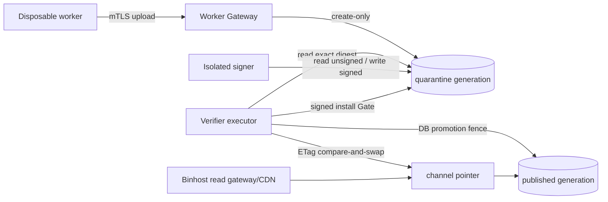

# Object storage contract

Portage Engine uses S3-compatible storage as an immutable bytes authority. The
PostgreSQL ledger remains the workflow and metadata authority; object storage
does not decide whether a build is admitted, verified, signed, or published.

## Current implementation

The `internal/storage` S3 adapter now supports AWS S3 and path-style compatible
services such as MinIO:

- create-only `PutObject` using `If-None-Match: *`;
- idempotent retry when the existing object's recorded SHA-256 matches;
- explicit conflict when the same key contains different bytes;
- SHA-256 metadata and verified, atomic local downloads;
- paginated listing and real `HeadObject` health checks;
- deletion disabled by default and available only to an explicitly privileged
  lifecycle client; and
- custom endpoint, region, prefix, public read base URL, and standard AWS SDK
  credential/workload-identity resolution.

PUB-1B and PUB-1C make the artifact data plane shared-filesystem-free:

- Worker Gateway collection uploads immutable
  `.quarantine/<token>/<relative-path>` objects;
- a revocable JSON capability binds the exact artifact set, sizes, SHA-256
  values, `Packages` digest, architecture, generation type, and expiry;
- verifier replicas materialize process-local scratch from objects and the
  public capability gateway rechecks every served digest;
- the isolated signer reads its leased unsigned token and writes a distinct
  signed token without mounting the control plane's `BINPKG_PATH`;
- publication creates a complete immutable generation, then changes only
  `.channels/stable.json` with an ETag compare-and-swap; and
- the public binhost gateway validates pointer → manifest → object digests,
  while package search loads the same verified `Packages` index.

`BINPKG_PATH` remains a compatibility authority only when
`STORAGE_TYPE=local`. In S3 mode it is not a cross-replica hand-off.
Separated active-phase deployments (`SERVER_RUNTIME_ROLE=api|executor`) are
therefore rejected at startup unless `STORAGE_TYPE=s3`: the persistent
executor and Worker Gateway terminate on different hosts, so an absolute local
quarantine path cannot be a shared artifact authority.

## External namespace

The consumer-visible namespace continues to follow Gentoo's release-tree
shape, as selected by each reviewed catalog profile:

```text
releases/<arch>/binpackages/<profile-generation>/<target>/
├── Packages
└── <category>/<package-version>.gpkg.tar
```

For example:

```text
releases/amd64/binpackages/23.0/x86-64_pe-systemd-base-v1/
├── Packages
└── app-misc/jq/jq-1.8.2.gpkg.tar
```

Different libc, init systems, sub-architectures, desktop variants, and custom
profiles must use different catalog-owned target paths. A request or worker
cannot choose the destination.

The object authority stores publication generations underneath the same
target:

```text
releases/.../<target>/.generations/<generation-id>/
├── Packages
├── manifest.json
└── <new objects for this generation>
```

`manifest.json` binds every consumer-relative path to an immutable object key,
size, SHA-256, signing key ID, catalog/profile identity, build attempt, and the
`Packages` digest. Schema v2 additionally binds a redacted build-input digest,
package atom, build mode, image generation/digest, mirror bundle, egress
policy, package sets, and repository revision/digest. Internal repository
locations and ConfigBundle contents are not published. Schema v1 remains
readable for in-place upgrades; all new publications use v2. Unchanged packages
may safely reference an older immutable generation, so publishing one package
does not copy the whole repository. A small ETag-fenced channel pointer selects
the active complete view. The read gateway maps the stable Gentoo-compatible
URL to that view, so clients still see an ordinary `Packages` file and package
paths while rollback and reconciliation remain deterministic.

## Write and read boundaries



Credentials must be split:

| Runtime | Required object permission |
| --- | --- |
| API / read gateway | read published generations and channel pointers |
| Worker Gateway | create quarantine objects only; no overwrite/delete |
| Signer | read one leased unsigned generation; create its signed generation; cleanup only its failed output prefix |
| Executor / publisher | read quarantine, create publication generation, compare-and-swap channel pointer |
| Reconciler | list/read metadata; no normal write |
| Lifecycle controller | retention-scoped generation delete; never shared with API/read runtimes |

Static access keys are acceptable only for the loopback development Gate.
Production should use workload identity or short-lived credentials and bucket
policy conditions that independently enforce the prefixes above.

Before Public Beta, export the effective provider policy for each role and run
the policy/restore coordinator in
[Public Beta recovery Gate](PUBLIC_BETA_RECOVERY.md#object-storage-phase). It
also requires quarantine deletion and published-generation GC to use distinct
principals; `STORAGE_S3_ALLOW_DELETE` alone is not evidence of that split.

## Local MinIO Gate

The Compose `object-storage` profile starts a loopback-only, single-node MinIO
service and creates a versioned, object-lock-capable development bucket:

```bash
docker compose --env-file .env.compose.example \
  --profile object-storage up -d minio minio-init
```

Run the real adapter Gate from the host:

```bash
PORTAGE_S3_INTEGRATION=1 \
STORAGE_S3_ENDPOINT=http://127.0.0.1:29000 \
STORAGE_S3_BUCKET=portage-engine-artifacts \
STORAGE_S3_REGION=us-east-1 \
AWS_ACCESS_KEY_ID=portage-minio-local \
AWS_SECRET_ACCESS_KEY=portage-minio-secret-local \
go test ./internal/storage -run TestS3StorageIntegration -v
```

The real Gate covers immutable retry/conflict, quarantine capability
activation/revocation, ETag CAS create/update/stale-writer rejection, deep
publication audit, replication to an independent prefix, and reference-aware
generation GC.

## Reconciliation, replication, and GC

Use the listener-free lifecycle binary with a credential dedicated to the
operation:

```bash
portage-artifact-lifecycle \
  -operation audit \
  -binhost-path releases/amd64/binpackages/23.0/x86-64_pe-systemd-base-v1 \
  -arch amd64
```

Replication reads `STORAGE_S3_*` for the source and `REPLICA_STORAGE_S3_*` for
the destination. Both clients currently use the process AWS credential chain,
so the workload role must be allowed to read the source and create/CAS the
destination:

```bash
portage-artifact-lifecycle \
  -operation replicate \
  -binhost-path releases/amd64/binpackages/23.0/x86-64_pe-systemd-base-v1 \
  -arch amd64
```

GC requires both `STORAGE_S3_ALLOW_DELETE=true` and a bucket policy that limits
`DeleteObject` to the reviewed publication prefix. It retains the active
generation, the rollback generation, and every older generation still
referenced by either manifest. Incomplete generations without a valid
manifest are intentionally left to a separate age-based bucket lifecycle:

```bash
portage-artifact-lifecycle \
  -operation gc \
  -retention 336h \
  -binhost-path releases/amd64/binpackages/23.0/x86-64_pe-systemd-base-v1 \
  -arch amd64
```

MinIO in this profile is a development dependency, not the production
availability model. The code and local Gate cover channel races, reconciliation,
replication and reference-aware retention semantics. A production deployment
must still provide evidence for object-service node/zone loss, provider
versioning/retention enforcement, cross-site recovery time, workload credential
revocation, interrupted large transfers, and restore from an independently
administered copy.
