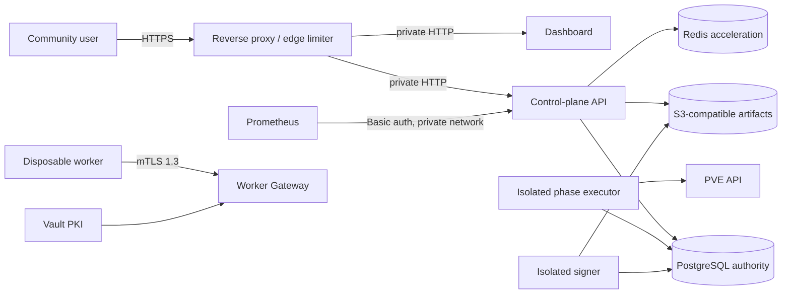

# Production boundary

`DEPLOYMENT_MODE` separates the local/trusted compatibility surface from the
requirements for a community-facing deployment:

- `trusted` is the default. It supports the existing loopback Compose stack,
  trusted-LAN HTTP, the file-backed worker CA and local/NFS artifact paths.
- `public` is a fail-closed readiness contract. The server and dashboard refuse
  to start when a compatibility credential or insecure transport option is
  enabled.

Changing the mode does not turn the development Compose file into a production
deployment. Public mode deliberately reports the remaining infrastructure
blockers instead of silently weakening them.

## TLS boundary

The API and dashboard processes may continue to use HTTP behind a reverse
proxy or ingress on a private service network. The public edge must terminate
HTTPS, preserve the original host, and prevent direct access to the backend
ports. The dedicated Worker Gateway remains end-to-end TLS 1.3 with client
certificate verification.

Public dashboard cookies are always `Secure`. Identity-provider issuer and
callback URLs and CORS origins must be HTTPS. `OIDC_ALLOW_INSECURE_HTTP` is only
available in trusted mode.

The read-only reference edge consists of
`deploy/public-edge/nginx.conf.template` and
`deploy/public-edge/docker-compose.edge.yml`. Apply all three Compose files;
the final overlay uses Compose `!reset` to remove the API and Dashboard host
ports and every inherited database/cache/observability port, joins the HTTP
services to an internal edge network, and publishes only the HTTP redirect,
HTTPS edge, and Worker Gateway mTLS listener on an explicitly selected private
worker-network address:

```bash
docker compose \
  -f docker-compose.yml \
  -f docker-compose.public.yml \
  -f deploy/public-edge/docker-compose.edge.yml \
  up -d
```

The edge expects deployment-owned external secrets named
`portage_public_tls_cert`, `portage_public_tls_key`, and
`portage_metrics_htpasswd`. Do not replace them with checked-in certificates
or password files. `deploy/public-edge/public.env.example` contains only
non-secret host and policy inputs. Set `PORTAGE_WORKER_GATEWAY_BIND` to one
exact private/VLAN interface address; the edge overlay deliberately has no
public/default bind for the mTLS Worker Gateway.

The reference access log records `$uri`, never `$request_uri`; OAuth callback
authorization codes therefore do not enter edge logs. Preserve that property
when translating the example to a managed load balancer.

## Server requirements

For a control-plane process, public mode requires:

- `SERVER_RUNTIME_ROLE=api`; the combined trusted role is rejected;
- PostgreSQL and Redis in required mode;
- pure OIDC authentication with at least one configured provider and immutable
  bootstrap administrator identity;
- no legacy API key, step-up key, builder shared token or static remote builder;
- an explicit HTTPS CORS allowlist without `*`;
- `TRUSTED_PROXY_CIDRS` naming the exact ranges the edge connects from;
- active durable phase execution;
- the mTLS Worker Gateway with the Vault issuer;
- an operator-selected GPG key and disabled key auto-creation;
- verified PVE and SSH transports;
- a metrics password whenever metrics are enabled; and
- `STORAGE_TYPE=s3` with an explicit bucket and region.

`TRUSTED_PROXY_CIDRS` has no default and `docker-compose.public.yml` renders it
as `${PORTAGE_TRUSTED_PROXY_CIDRS:?...}`, so the public stack refuses to render
until the deployment supplies one. There is nothing safe to guess: the value is
the address range the edge actually connects to the API from, which only that
deployment knows. For the bundled single-nginx edge it is the Compose bridge
subnet carrying the edge-to-API hop — `deploy/public-edge/public.env.example`
ships `PORTAGE_TRUSTED_PROXY_CIDRS=172.18.0.0/16` as the shape, but confirm the
real one with `docker network inspect portage-engine_portage-net`, because
Compose allocates that subnet and it is not stable across hosts. Behind a
managed load balancer or an ingress controller, list the balancer's egress
ranges instead, and list every one of them.

Both ways of getting it wrong are silent. Too narrow — or absent, which is
what the `:?` guard exists to prevent — means the edge is not a trusted hop:
`X-Forwarded-For` is ignored, the client address falls back to `RemoteAddr`,
and every anonymous caller behind the edge shares one pre-auth rate-limit
bucket, so a single client at the per-minute budget locks CLI login and the
binhost out for everyone. Too wide is worse: any host inside the declared range
can forge `X-Forwarded-For`, choose its own rate-limit bucket, and put an
address of its choosing into the audit record. Declare the edge and nothing
else.

PUB-1A through PUB-1C are implemented. In S3 mode, quarantine upload,
verification capability, signer hand-off, immutable generation publication,
ETag-fenced channel selection, public reads and package search no longer use a
shared `BINPKG_PATH`. The real MinIO Gate also covers stale-writer rejection,
deep audit, replication and reference-aware GC. See
[Object storage contract](OBJECT_STORAGE.md).

The API/read role must not receive `DeleteObject`. Executor and signer cleanup
credentials are limited to `.quarantine/*`; the separately scheduled lifecycle
role may delete old `.generations/*` only after reference-aware retention.
Production must enforce those scopes in bucket policy—the
`STORAGE_S3_ALLOW_DELETE` switch is a second application-side guard, not an IAM
replacement.

The same `portage-server` binary has three explicit runtime roles:

| Role | Listener | Admission | Phase execution / Terraform cleanup |
| --- | --- | --- | --- |
| `control-plane` | API + optional Worker Gateway | Yes | Yes; trusted compatibility only |
| `api` | API + Worker Gateway | Yes | No |
| `executor` | None | No | Yes |

Public mode rejects the combined role. The API process must not receive PVE,
cloud-provider or SSH credentials; executor processes receive only the
credentials and exact capability labels for their immutable pool.

The Dockerfile exposes matching production targets:

- `api-runtime`
- `dashboard-runtime`
- `migrate-runtime`
- `signer-runtime`
- `executor-runtime`
- `actuator-runtime`
- `artifact-lifecycle-runtime`

These targets contain only their service binary and required runtime tools and
run as UID/GID `65532`. The final `trusted-runtime` target preserves the
single-image, root development Compose workflow.

## Dashboard requirements

Public mode requires provider-backed authentication, `ALLOW_ANONYMOUS=false`,
`COOKIE_SECURE=true`, HTTPS provider redirects and no local administrator or
backend API-key credentials. `SERVER_URL` may remain an internal HTTP origin
when network policy restricts it to the dashboard-to-API hop.

## Operational endpoints

- `/livez` and `/readyz` remain public, minimal load-balancer probes.
- `/health` contains database, ledger, worker and issuer inventory and now
  requires a system administrator identity.
- `/metrics` and `/metrics/prometheus` retain their dedicated Basic
  authentication. Public mode refuses to start metrics without
  `METRICS_PASSWORD`.

Prometheus credentials belong in the production secret provider. Do not put
them in the checked-in scrape configuration.

## Web shell

The API web shell remains system-administrator-only. Browser-originated
WebSocket upgrades are accepted only from the API origin or an explicit CORS
origin; the server-side dashboard proxy is allowed without an `Origin` header.
Production deployments should disable routing to this endpoint until a
short-lived SSH certificate and session-recording implementation replaces the
long-lived operator key.

The Public Beta reference edge does not route WebShell at all. It returns 404
for Dashboard `/shell/` and `/api/shell` and API
`/api/v1/instances/shell`, regardless of authentication or `Origin`. This is a
stricter release boundary than the application-level system-admin/origin
checks and is intentional.

## Required production topology



The edge must enforce an independent source-IP/request-rate policy. Redis
failure remains fail-open inside the application because Redis is not a
correctness authority; it is therefore not the public denial-of-service
boundary.

The reference uses independent connection, general-request, identity-request,
and metrics zones keyed from the socket source IP. It replaces, rather than
appends to, an untrusted client `X-Forwarded-For` header. When another trusted
load balancer sits in front, configure its real-IP trust list explicitly;
never trust arbitrary forwarded addresses.

The `/api/v1/iam/device/` prefix is anonymous, write-backed identity traffic:
authorization creation, token polling, and the authenticated decision route
all use the stricter identity-request zone as well as the general request zone.
Every response on that prefix is marked `Cache-Control: no-store`. Do not let
these routes fall through to the general 20 requests/second API location.

Metrics use a distinct hostname. The edge htpasswd entry must use username
`metrics` and the same password injected as the server's
`METRICS_PASSWORD`, so both the edge and application independently verify the
Basic Authorization header. Restrict the metrics hostname to scraper source
ranges in the external firewall as well.

## Repository and real-host Gates

The repository Gate parses all Compose overlays without interpolating or
inventing production credentials, checks the static boundary, and validates a
rendered Nginx configuration in the operator-selected container image. Set
`PORTAGE_EDGE_IMAGE` to the same deployment-reviewed digest-pinned image used
by Compose for reproducible evidence:

```bash
scripts/validate-public-edge.sh \
  --output evidence/public-beta/repository-gate.json
```

The real-host Gate is separate and destructive to the dedicated test sessions
it receives. It accepts session cookies, bearer tokens, and metrics credentials
only from process environment, keeps HTTP bodies in memory, and writes only a
redacted manifest:

```bash
PORTAGE_GATE_RUN_LIVE=1 \
PORTAGE_PUBLIC_BASE_URL=https://portage.example.org \
PORTAGE_API_BASE_URL=https://api.portage.example.org \
PORTAGE_METRICS_BASE_URL=https://metrics.portage.example.org \
scripts/public-identity-gate.py \
  --output evidence/public-beta/identity-gate.json
```

See [Community identity providers](IDENTITY_PROVIDERS.md) for the required
deployment-owned inputs. Both tools use exit `0` only when every check in their
scope passed, `1` for a failed check, `2` for invocation/dependency errors, and
`3` when required real credentials, endpoints, or observations were not
provided. Exit `3` and manifest status `not_run` are never release success.
Sensitive values and response bodies must not be attached to the manifest or
stored in the repository.

The fail-closed coordinator, evidence schema, phase inputs, and exact live
commands are documented in [Public Beta recovery Gate](PUBLIC_BETA_RECOVERY.md).
Repository-only validation records every external phase as `not-run`; it is not
production recovery evidence.

Before switching a deployment to `public`, preserve evidence for:

1. rejected startup with every unsafe compatibility option;
2. Authentik, Google OIDC, and GitHub OAuth provider-only Dashboard login and
   callback through the real HTTPS hostname, including state, nonce, and PKCE;
3. unauthenticated `/livez` and `/readyz`, authenticated `/health`, and
   password-protected metrics;
4. idle and absolute session lifetime, single-session revoke, subject
   revoke-all, local and Authentik back-channel logout, and high-risk fresh-auth
   step-up;
5. distinct `(issuer, subject)` rows for equal email values from different
   providers;
6. rejected foreign-origin shell WebSocket and no Public Beta WebShell route;
7. Vault issuer recovery and CA rollover;
8. authoritative-current-schema PostgreSQL full/differential/WAL/PITR restore
   (the production upgrade history starts at v26), including ledger, workload
   identity, capacity, target and database-role integrity;
9. immutable S3 generation publication, channel rollback, deep reconciliation,
   cross-site replication, split quarantine/generation deletion authority and
   reference-aware GC;
10. public `/packages`, `/docs`, `/status`, `/binpkgs/.../Packages` and package
   downloads through the external HTTPS hostname without a login; and
11. offline encrypted signer-key backup, isolated restore, old/new dual-key
   verification, retained-generation/rollback compatibility, and live proof
   that Builder, API and Dashboard have no private key.
