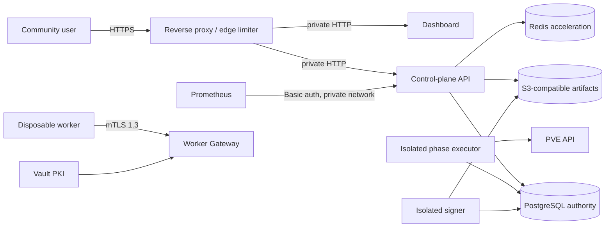

# Production boundary

`DEPLOYMENT_MODE` separates the local/trusted compatibility surface from the
requirements for a community-facing deployment:

- `trusted` is the default. It supports the existing loopback Compose stack,
  trusted-LAN HTTP, the file-backed worker CA and local/NFS artifact paths.
- `public` is a fail-closed readiness contract. The server and dashboard refuse
  to start when a compatibility credential or insecure transport option is
  enabled.

Changing the mode does not turn the development Compose file into a production
deployment. Public mode deliberately reports the remaining infrastructure
blockers instead of silently weakening them.

## TLS boundary

The API and dashboard processes may continue to use HTTP behind a reverse
proxy or ingress on a private service network. The public edge must terminate
HTTPS, preserve the original host, and prevent direct access to the backend
ports. The dedicated Worker Gateway remains end-to-end TLS 1.3 with client
certificate verification.

Public dashboard cookies are always `Secure`. Identity-provider issuer and
callback URLs and CORS origins must be HTTPS. `OIDC_ALLOW_INSECURE_HTTP` is only
available in trusted mode.

## Server requirements

For a control-plane process, public mode requires:

- `SERVER_RUNTIME_ROLE=api`; the combined trusted role is rejected;
- PostgreSQL and Redis in required mode;
- pure OIDC authentication with at least one configured provider and immutable
  bootstrap administrator identity;
- no legacy API key, step-up key, builder shared token or static remote builder;
- an explicit HTTPS CORS allowlist without `*`;
- active durable phase execution;
- the mTLS Worker Gateway with the Vault issuer;
- an operator-selected GPG key and disabled key auto-creation;
- verified PVE and SSH transports;
- a metrics password whenever metrics are enabled; and
- `STORAGE_TYPE=s3` with an explicit bucket and region.

PUB-1A through PUB-1C are implemented. In S3 mode, quarantine upload,
verification capability, signer hand-off, immutable generation publication,
ETag-fenced channel selection, public reads and package search no longer use a
shared `BINPKG_PATH`. The real MinIO Gate also covers stale-writer rejection,
deep audit, replication and reference-aware GC. See
[Object storage contract](OBJECT_STORAGE.md).

The API/read role must not receive `DeleteObject`. Executor and signer cleanup
credentials are limited to `.quarantine/*`; the separately scheduled lifecycle
role may delete old `.generations/*` only after reference-aware retention.
Production must enforce those scopes in bucket policy—the
`STORAGE_S3_ALLOW_DELETE` switch is a second application-side guard, not an IAM
replacement.

The same `portage-server` binary has three explicit runtime roles:

| Role | Listener | Admission | Phase execution / Terraform cleanup |
| --- | --- | --- | --- |
| `control-plane` | API + optional Worker Gateway | Yes | Yes; trusted compatibility only |
| `api` | API + Worker Gateway | Yes | No |
| `executor` | None | No | Yes |

Public mode rejects the combined role. The API process must not receive PVE,
cloud-provider or SSH credentials; executor processes receive only the
credentials and exact capability labels for their immutable pool.

The Dockerfile exposes matching production targets:

- `api-runtime`
- `dashboard-runtime`
- `migrate-runtime`
- `signer-runtime`
- `executor-runtime`
- `actuator-runtime`
- `artifact-lifecycle-runtime`

These targets contain only their service binary and required runtime tools and
run as UID/GID `65532`. The final `trusted-runtime` target preserves the
single-image, root development Compose workflow.

## Dashboard requirements

Public mode requires provider-backed authentication, `ALLOW_ANONYMOUS=false`,
`COOKIE_SECURE=true`, HTTPS provider redirects and no local administrator or
backend API-key credentials. `SERVER_URL` may remain an internal HTTP origin
when network policy restricts it to the dashboard-to-API hop.

## Operational endpoints

- `/livez` and `/readyz` remain public, minimal load-balancer probes.
- `/health` contains database, ledger, worker and issuer inventory and now
  requires a system administrator identity.
- `/metrics` and `/metrics/prometheus` retain their dedicated Basic
  authentication. Public mode refuses to start metrics without
  `METRICS_PASSWORD`.

Prometheus credentials belong in the production secret provider. Do not put
them in the checked-in scrape configuration.

## Web shell

The API web shell remains system-administrator-only. Browser-originated
WebSocket upgrades are accepted only from the API origin or an explicit CORS
origin; the server-side dashboard proxy is allowed without an `Origin` header.
Production deployments should disable routing to this endpoint until a
short-lived SSH certificate and session-recording implementation replaces the
long-lived operator key.

## Required production topology

The edge must enforce an independent source-IP/request-rate policy. Redis
failure remains fail-open inside the application because Redis is not a
correctness authority; it is therefore not the public denial-of-service
boundary.

## Gate

Before switching a deployment to `public`, preserve evidence for:

1. rejected startup with every unsafe compatibility option;
2. provider-only dashboard login through the real HTTPS hostname;
3. unauthenticated `/livez` and `/readyz`, authenticated `/health`, and
   password-protected metrics;
4. rejected foreign-origin shell WebSocket;
5. Vault issuer recovery and CA rollover;
6. schema-current PostgreSQL full/differential/PITR restore; and
7. immutable S3 generation publication, channel rollback, deep reconciliation,
   cross-site replication and reference-aware GC; and
8. public `/packages`, `/docs`, `/status`, `/binpkgs/.../Packages` and package
   downloads through the external HTTPS hostname without a login.
