# Portage Engine

[](https://github.com/slchris/portage-engine/actions/workflows/ci.yml)
[](https://goreportcard.com/report/github.com/slchris/portage-engine)
[](https://github.com/slchris/portage-engine/actions/workflows/codeql.yml)
[](LICENSE)

Portage Engine is a self-hosted Gentoo binary-package build and publishing
system. It provisions isolated workers, runs native `emerge` builds, verifies
GPKG artifacts and publishes a standard Portage binhost.

> **Status: trusted alpha.** PVE + Terraform + native Gentoo is the reference
> backend and has been exercised on real infrastructure. The service is for a
> trusted private network while public multi-tenant identity, quota, isolation
> and abuse controls remain roadmap items.

## Pick your workflow

| You are… | Normal workflow | Extra client? |
| --- | --- | --- |
| Binpkg consumer | Configure the binhost once, then use `emerge --getbinpkg` | No |
| Developer | Submit an explicit remote build, then install with `emerge` | `portage-client` |
| Infra operator | Manage builders, images, signing, storage and release policy | Server/dashboard tools |

Consume a published package with native Portage:

```bash
sudo ./bin/portage-client configure \
  -server=http://portage-engine.infra.lan:8080 \
  -profile-id=pe/amd64/glibc/systemd/base-v1

emerge --getbinpkg app-editors/vim

# Do not fall back to a local source build:
emerge --getbinpkgonly app-editors/vim
```

The configure command resolves the profile to an official-style namespace such
as `/binpkgs/releases/amd64/binpackages/23.0/x86-64_pe-systemd-base-v1`.
Different profiles have independent `Packages` indexes; `/binpkgs/` itself is
not an aggregate repository.

Developers request missing packages explicitly because Portage has no native
“ask this binhost to build” protocol:

```bash
export PORTAGE_ENGINE_API_KEY='read-from-a-secret-store'

./bin/portage-client build \
  -server=http://portage-engine.infra.lan:8080 \
  -package=dev-lang/python -version=3.11 \
  -profile-id=pe/amd64/glibc/systemd/base-v1 \
  -resource-class=medium -wait
```

Trusted-LAN bring-up may use HTTP; bind/firewall it to that network because API
keys are plaintext on the wire. Add HTTPS before crossing an untrusted network.

The consumer path needs neither the CLI nor an overlay. An overlay is useful
only for distributing the optional client/service ebuilds; it must not own the
published binpkg trust key or image/profile policy.

## Components

```mermaid
flowchart LR
    Client[CLI / Web] --> API[Server + scheduler]
    API --> Worker[Disposable PVE / native worker]
    Worker --> Build[Native emerge]
    Build --> Stage[Unsigned quarantine]
    Stage --> Verify[Unsigned install / GUI verification]
    Verify --> Queue[(PostgreSQL signing task)]
    Queue --> Signer[Isolated outbound-pull signer]
    Signer --> SignedVerify[Signed install verification]
    SignedVerify --> Publish[Immutable signed binhost]
    Publish --> Portage[User emerge]
```



- `portage-server`: API, job state, scheduling, IaC and binhost publication.
- `portage-builder`: native Gentoo execution and install checks.
- `portage-signer`: digest-bound queue worker and the only private-key owner.
- `portage-dashboard`: builds, nodes, logs and read-only factory evidence.
- `portage-client`: optional developer CLI.
- `portage-desktop-runner`: deterministic native-GUI verification.
- `image-factory/`: offline Packer/Catalyst image and release gates.

## Development quick start

Requires Go 1.26.5; real builds require a native Gentoo disposable root or VM.

```bash
git clone https://github.com/slchris/portage-engine.git
cd portage-engine
go mod download
make build
go test ./...
```

Run the development topology:

```bash
cp .env.compose.example .env.compose
scripts/check-compose-ports.sh .env.compose
# Safe to repeat; applies embedded reviewed SQL with the database owner.
docker compose --env-file .env.compose run --rm portage-migrate
docker compose --env-file .env.compose up -d
docker compose --env-file .env.compose ps
scripts/verify-compose.sh .env.compose
```

- API/binhost: `http://127.0.0.1:18080`
- Dashboard: `http://127.0.0.1:18081` (`admin` / `portage-demo`)
- Grafana: `http://127.0.0.1:23000` (`admin` / `portage-grafana-local`)
- Prometheus: `http://127.0.0.1:29090`

The Compose stack also publishes loopback-only development endpoints for Loki
(`23100`), Tempo (`23200`), OTLP gRPC/HTTP (`24317`/`24318`), PostgreSQL
(`25432`) and Redis (`26379`). Change any mapping in `.env.compose` when the
preflight script reports a collision. The checked-in credentials are local
defaults only; replace them before exposing any service beyond localhost.

Compose does not start package builders or mount the host Docker socket. It
does start the control plane plus its local PostgreSQL, Redis and observability
foundation. PostgreSQL/Redis metrics and current process logs are collected
now; shared process log files rotate at 10 MiB with one backup and Docker JSON
logs are capped separately. Schema v7 makes PostgreSQL the sole online job,
infrastructure-cleanup and signing-task authority. The signer uses a
least-privilege database role and a separate private GPG volume; server replicas
see only its public key and queue status. Queue claims, attempts, leases/fencing,
cancel/retry, redacted logs, cleanup leases, artifact/factory metadata and
audited runtime settings survive replica failure. Publication is serialized
across replicas and binpkg locations are immutable. JSON job snapshots are
disabled whenever the database is enabled. Redis remains disposable.

Run a second local control-plane replica on port `18082`:

```bash
docker compose --env-file .env.compose \
  -f docker-compose.yml -f docker-compose.ha.yml up -d
```

Create a logical backup and prove it restores into an isolated database:

```bash
scripts/postgres-backup.sh /mnt/portage-nas/postgres/portage-engine.dump
scripts/postgres-restore-check.sh /mnt/portage-nas/postgres/portage-engine.dump
```

Keep PostgreSQL `PGDATA` on reliable local block storage. Only backup/WAL
repositories and restore evidence belong on the internal NAS. The optional
PITR overlay uses an encrypted pgBackRest repository:

```bash
export PORTAGE_PGBACKREST_CIPHER_PASS='use-a-secret-provider'
export PORTAGE_PGBACKREST_REPO=/mnt/portage-nas/postgres/pgbackrest
docker compose -f docker-compose.yml -f docker-compose.pgbackrest.yml up -d postgres
scripts/pgbackrest-init.sh
scripts/pgbackrest-backup.sh full
scripts/pgbackrest-restore-drill.sh
```

## Deployment and security

The PVE path clones a native Gentoo cloud-init template, runs
`emerge --buildpkg`, collects the result and performs install verification.
Native emerge mutates the guest root even with `--oneshot`, so builders are
single-use: the server destroys the VM after publication instead of returning
it to a warm pool. The former Docker/static-builder execution path has been
removed.
Profiles, repository commits, image generations and package sets are resolved
from an operator-owned immutable catalog. Packer/Catalyst outputs remain
candidate-only until their documented smoke, evidence, promotion and rollback
gates pass.

The current trusted-alpha boundary includes strict request/config validation,
server-owned catalog resolution, immutable repository revisions, API/builder
authentication, strict SSH host keys, quarantine/promotion separation and an
isolated outbound-pull signer. Builders emit only unsigned GPKG files; neither
builder nor server mounts the private release key. A public community service
still needs OIDC/RBAC, per-project quotas, short-lived worker identity, and
workload/egress isolation.

The state platform supports multiple control-plane replicas through PostgreSQL
`FOR UPDATE SKIP LOCKED` claims, short leases and fencing tokens. Non-secret
cloud settings are versioned and audited in PostgreSQL; credential values are
rejected by the shared settings API and must be injected through environment or
a deployment secret provider. A pre-apply resource manifest plus
provider-native absence check prevents an asynchronous PVE clone from being
orphaned when Terraform is killed before writing state. Redis remains a
disposable acceleration layer; build correctness and publication do not depend
on it.

Never commit API tokens, PVE credentials, private signing keys or production
logs containing secrets.

## Documentation

- [Using the binhost and requesting builds](docs/USAGE.md)
- [Policy-validated Portage configuration](docs/SYSTEM_CONFIG_USAGE.md)
- [PVE native Gentoo deployment and testing](docs/PVE_TESTING.md)
- [Profiles and immutable build catalog](docs/CATALOG.md)
- [Offline Packer/Catalyst image factory](image-factory/README.md)
- [Desktop E2E](docs/DESKTOP_E2E.md)
- [Roadmap, security architecture and release gates](docs/ROADMAP_AND_DESKTOP_E2E.html)

Useful development checks:

```bash
go test ./...
go test -race ./internal/builder ./internal/server
go vet ./...
```

## License

[MIT](LICENSE)
