# Portage Engine

[](https://github.com/slchris/portage-engine/actions/workflows/ci.yml)
[](https://goreportcard.com/report/github.com/slchris/portage-engine)
[](https://github.com/slchris/portage-engine/actions/workflows/codeql.yml)
[](LICENSE)

Portage Engine is a self-hosted Gentoo binary-package build and publishing
system. It provisions isolated workers, runs native `emerge` builds, verifies
GPKG artifacts and publishes a standard Portage binhost.

> **Status: trusted alpha.** PVE + Terraform + native Gentoo is the reference
> backend and has been exercised on real infrastructure. The service is for a
> trusted private network. OIDC identity, project RBAC and PostgreSQL-atomic
> queued/active/UTC-daily admission plus per-attempt vCPU, memory and disk
> reservations, artifact-generation budgets, daily build-time/cloud-cost
> budgets, failure-storm cooldown, independently fenced
> provision/build/verify/publish execution, administrator step-up and
> cross-replica OIDC session revocation, exact executor routing and durable
> workload certificate/issuer revocation are implemented. Vault PKI external
> signing, listener-bound CA rollover and token recovery have a real-container
> Gate. Real community IdP callbacks, production Vault HA recovery and
> public-service hardening remain.

## Pick your workflow

| You are… | Normal workflow | Extra client? |
| --- | --- | --- |
| Binpkg consumer | Configure the binhost once, then use `emerge --getbinpkg` | No |
| Developer | Submit an explicit remote build, then install with `emerge` | `portage-client` |
| Infra operator | Manage builders, images, signing, storage and release policy | Server/dashboard tools |

The dashboard exposes `/packages`, `/docs`, and `/status` without an account.
Those pages use narrow, redacted read APIs; builds, logs, detailed health and
all administrative operations remain authenticated.

Consume a published package with native Portage:

```bash
sudo ./bin/portage-client configure \
  -server=http://portage-engine.infra.lan:8080 \
  -profile-id=pe/amd64/glibc/systemd/base-v1

emerge --getbinpkg app-editors/vim

# Do not fall back to a local source build:
emerge --getbinpkgonly app-editors/vim
```

The configure command resolves the profile to an official-style namespace such
as `/binpkgs/releases/amd64/binpackages/23.0/x86-64_pe-systemd-base-v1`.
Different profiles have independent `Packages` indexes; `/binpkgs/` itself is
not an aggregate repository.

Developers request missing packages explicitly because Portage has no native
“ask this binhost to build” protocol. In OIDC/hybrid mode, select an authorized
project and use a short-lived token:

```bash
export PORTAGE_ENGINE_TOKEN='read-from-your-identity-provider'
export PORTAGE_ENGINE_PROJECT='project-name-or-uuid'

./bin/portage-client build \
  -server=http://portage-engine.infra.lan:8080 \
  -package=dev-lang/python -version=3.11 \
  -profile-id=pe/amd64/glibc/systemd/base-v1 \
  -resource-class=medium -wait
```

The legacy `PORTAGE_ENGINE_API_KEY` remains a system-administrator migration
and break-glass path in `legacy`/`hybrid` mode. Trusted-LAN bring-up may use
HTTP, but API keys and bearer tokens are plaintext on the wire. Add HTTPS
before crossing an untrusted network.

`DEPLOYMENT_MODE=public` is a separate fail-closed contract for a
community-facing installation. It requires provider-only identity, explicit
HTTPS browser origins, Vault-issued worker identities, protected operational
endpoints and an S3-compatible artifact authority. The Go API/dashboard may
still use private HTTP behind a TLS-terminating edge. See
[Production boundary](docs/PRODUCTION_BOUNDARY.md).
The immutable adapter, key layout, role-specific permissions, and local MinIO
Gate are documented in [Object storage contract](docs/OBJECT_STORAGE.md).
The anonymous HTTP contract is published as
[OpenAPI 3.1](docs/openapi.yaml). Compatibility and community operations are
covered by [the compatibility policy](docs/COMPATIBILITY.md),
[security policy](SECURITY.md), [governance](GOVERNANCE.md), and
[maintainer list](MAINTAINERS.md).

The consumer path needs neither the CLI nor an overlay. An overlay is useful
only for distributing the optional client/service ebuilds; it must not own the
published binpkg trust key or image/profile policy.

## Components

```mermaid
flowchart LR
    Client[CLI / Web] --> API[Server + scheduler]
    API -->|provision + transient SSH bootstrap| Worker[Disposable PVE / native worker]
    Worker -->|outbound TLS 1.3 + attempt certificate| Gateway[Worker Gateway]
    Gateway --> API
    Worker --> Build[Native emerge]
    Build --> Stage[Unsigned quarantine]
    Stage --> Verify[Unsigned native install verification]
    Verify --> Queue[(PostgreSQL signing task)]
    Queue --> Signer[Isolated outbound-pull signer]
    Signer --> SignedVerify[Signed install verification]
    SignedVerify --> Publish[Immutable signed binhost]
    Publish --> Portage[User emerge]
```



- `portage-server`: API, job state, scheduling, IaC and binhost publication.
- `portage-builder`: native Gentoo execution and install checks.
- `portage-signer`: digest-bound queue worker and the only private-key owner.
- `portage-dashboard`: builds, nodes, logs and read-only factory evidence.
- `portage-client`: optional developer CLI.
- `portage-desktop-runner`: deterministic native-GUI verification; its version-2 matrix consumes signed candidate binpkgs.
- `image-factory/`: offline Packer/Catalyst image and release gates.

The default Docker target is the combined trusted-LAN runtime. Public
deployments select the non-root `api-runtime`, `executor-runtime`,
`signer-runtime`, `dashboard-runtime`, `migrate-runtime`, and
`actuator-runtime` and `artifact-lifecycle-runtime` targets so the
internet-facing API never receives PVE/SSH credentials or phase-execution
tooling. Docker base images are pinned by multi-platform digest. CI exports an
SPDX SBOM, BuildKit provenance and SHA-256 checksums for every production
runtime target; binary artifacts also include per-platform checksums. The
digest-authoritative GHCR community release, keyless signing, candidate to
stable promotion, rollback, and independent verification contract is in
[release/README.md](release/README.md).

## Development quick start

Requires Go 1.26.5; real builds require a native Gentoo disposable root or VM.

```bash
git clone https://github.com/slchris/portage-engine.git
cd portage-engine
go mod download
make build
go test ./...
```

Run the development topology:

```bash
cp .env.compose.example .env.compose
scripts/check-compose-ports.sh .env.compose
# Safe to repeat; applies embedded reviewed SQL with the database owner.
docker compose --env-file .env.compose run --rm portage-migrate
docker compose --env-file .env.compose up -d
docker compose --env-file .env.compose ps
scripts/verify-compose.sh .env.compose
```

To exercise PVE workers without exposing a builder listener, generate the
worker-only PKI and enable the dedicated gateway in `.env.compose`:

```bash
WORKER_GATEWAY_HOST=portage-engine.infra.lan \
  scripts/generate-worker-pki.sh .local/worker-pki
# Set PORTAGE_WORKER_GATEWAY_ENABLED=true, its LAN bind address, and
# PORTAGE_WORKER_GATEWAY_ADVERTISE_URL=https://portage-engine.infra.lan:19444
# Keep PORTAGE_PHASE_EXECUTOR_MODE=shadow for rollout; active additionally
# requires PostgreSQL authority, the Worker Gateway, shared state and
# capability-equivalent replicas.
```

This TLS requirement applies only to the worker identity channel. The normal
API/dashboard can remain HTTP during trusted-LAN bring-up.

- API/binhost: `http://127.0.0.1:18080`
- Dashboard: `http://127.0.0.1:18081` (`admin` / `portage-demo`)
- Grafana: `http://127.0.0.1:23000` (`admin` / `portage-grafana-local`)
- Prometheus: `http://127.0.0.1:29090`

The Compose stack also publishes loopback-only development endpoints for Loki
(`23100`), Tempo (`23200`), OTLP gRPC/HTTP (`24317`/`24318`), PostgreSQL
(`25432`) and Redis (`26379`). Change any mapping in `.env.compose` when the
preflight script reports a collision. The checked-in credentials are local
defaults only; replace them before exposing any service beyond localhost.

Compose does not start package builders or mount the host Docker socket. It
does start the control plane plus its local PostgreSQL, Redis and observability
foundation. PostgreSQL/Redis metrics and current process logs are collected
now; shared process log files rotate at 10 MiB with one backup and Docker JSON
logs are capped separately. Schema v28 makes PostgreSQL the sole online job,
infrastructure-cleanup, signing-task, external-subject and project-membership
authority, including versioned project admission policy and active-attempt
resource/phase/artifact/runtime reservations, phase execution context and
durable Worker Gateway commands/uploads. It also owns OIDC session lifetime,
idle expiry, revocation and per-subject token watermarks. The signer uses a
least-privilege database role and a separate private GPG volume; server replicas
see only its public key and queue status. Queue claims, attempts, leases/fencing,
cancel/retry, redacted logs, cleanup leases, artifact/factory metadata and
audited runtime settings survive replica failure. Publication is serialized
across replicas and binpkg locations are immutable. JSON job snapshots are
disabled whenever the database is enabled. Redis remains disposable.
Project admission and phase dispatch use shared weighted virtual runtime with
queue-age anti-starvation. Pull-aware worker score decisions and 24h/7d/30d
target SLO/latency/cost history are visible in Monitor. Autoscaling can remain
observe-only or write globally and per-provider budgeted single-slot actions
for the separate, listener-free `portage-capacity-actuator`; provider calls
never occur in a scheduler transaction.

To exercise the real S3-compatible adapter locally, start the opt-in MinIO
profile and run its integration Gate:

```bash
docker compose --env-file .env.compose.example \
  --profile object-storage up -d minio minio-init

PORTAGE_S3_INTEGRATION=1 \
STORAGE_S3_ENDPOINT=http://127.0.0.1:29000 \
STORAGE_S3_BUCKET=portage-engine-artifacts \
STORAGE_S3_REGION=us-east-1 \
AWS_ACCESS_KEY_ID=portage-minio-local \
AWS_SECRET_ACCESS_KEY=portage-minio-secret-local \
go test ./internal/storage -run TestS3StorageIntegration -v
```

Run a second local control-plane replica on port `18082`:

```bash
docker compose --env-file .env.compose \
  -f docker-compose.yml -f docker-compose.ha.yml up -d
```

Create a logical backup and prove it restores into an isolated database:

```bash
scripts/postgres-backup.sh /mnt/portage-nas/postgres/portage-engine.dump
scripts/postgres-restore-check.sh /mnt/portage-nas/postgres/portage-engine.dump
```

Keep PostgreSQL `PGDATA` on reliable local block storage. Only backup/WAL
repositories and restore evidence belong on the internal NAS. The optional
PITR overlay uses an encrypted pgBackRest repository:

```bash
export PORTAGE_PGBACKREST_CIPHER_PASS='use-a-secret-provider'
export PORTAGE_PGBACKREST_REPO=/mnt/portage-nas/postgres/pgbackrest
docker compose -f docker-compose.yml -f docker-compose.pgbackrest.yml up -d postgres
scripts/pgbackrest-init.sh
scripts/pgbackrest-backup.sh full
scripts/pgbackrest-restore-drill.sh
```

## Deployment and security

The PVE path clones a native Gentoo cloud-init template, runs
`emerge --buildpkg`, collects the result and performs install verification.
Native emerge mutates the guest root even with `--oneshot`, so builders are
single-use: the server destroys the VM after publication instead of returning
it to a warm pool. The former Docker/static-builder execution path has been
removed.
Profiles, repository commits, image generations and package sets are resolved
from an operator-owned immutable catalog. Packer/Catalyst outputs remain
candidate-only until their documented smoke, evidence, promotion and rollback
gates pass.

The current trusted-alpha boundary includes strict request/config validation,
server-owned catalog resolution, immutable repository revisions, per-attempt
worker mTLS identity, VM-level egress default-deny, quarantine/promotion
separation, an isolated outbound-pull signer, exact-issuer OIDC verification
and project roles (`viewer`, `developer`, `maintainer`, `owner`). Job queries,
mutations, overview statistics and SSE streams are project-scoped; mutable
username/email/token group claims never grant authorization. Disposable builders open no
inbound build API: after transient SSH bootstrap succeeds, the target PVE VM is
switched to `policy_in=DROP`, all of that VM's inbound allow rules are removed,
and both options and rule-list readbacks are verified. Cluster/Node policy and
other VMs are not changed. Builders emit only unsigned GPKG files; neither
builder nor server mounts the private release key. Project policy serializes
submissions and scheduler claims in PostgreSQL: queued, active and UTC-day
limits cannot be oversubscribed by multiple replicas, and suspension stops new
submissions, retries and claims. Each claim reserves its catalog maximum
runtime and estimated cloud cost, terminal settlement charges actual wall
time, and repeated failed/expired attempts trigger a separately auditable
time-bounded suspension. High-risk administrator writes require fresh OIDC
authentication or an independent legacy step-up key; OIDC sessions can be
listed, individually revoked, or revoked across all replicas. The CLI can
obtain a one-time platform session through the authenticated Dashboard without
copying a provider credential; PostgreSQL stores only capability digests and
serializes approval consumption. A public
community service still needs production identity-provider callback validation,
a Vault HA/unseal/backup runbook and a site-built, reviewed
persistent-executor PVE candidate for the live actuator Gate. The repository
now provides the separate candidate build and fail-closed Gate entry, but does
not claim live PVE evidence without operator credentials. Schema v24 derives
provider/zone/architecture/profile/image capacity pools, reports their demand,
and persists fenced action/instance ownership, heartbeat, drain and deletion
state. Heterogeneous executors use the same exact pool/capability routing, and
missing labels fail closed. The existing disposable job-builder template is
not accepted as an autoscaled persistent executor.

The state platform supports multiple control-plane replicas through PostgreSQL
`FOR UPDATE SKIP LOCKED` claims, short leases and fencing tokens. Non-secret
cloud settings are versioned and audited in PostgreSQL; credential values are
rejected by the shared settings API and must be injected through environment or
a deployment secret provider. A pre-apply resource manifest plus
provider-native absence check prevents an asynchronous PVE clone from being
orphaned when Terraform is killed before writing state. Redis remains a
disposable acceleration layer; build correctness and publication do not depend
on it.

Never commit API tokens, PVE credentials, private signing keys or production
logs containing secrets.

## Documentation

- [Using the binhost and requesting builds](docs/USAGE.md)
- [Federated identity and project RBAC](docs/IAM.md)
- [Scheduler fairness and autoscaling](docs/SCHEDULER.md)
- [Observability alert runbooks and drills](docs/OBSERVABILITY_RUNBOOKS.md)
- [Authentik, Google, GitHub, and generic OIDC providers](docs/IDENTITY_PROVIDERS.md)
- [Policy-validated Portage configuration](docs/SYSTEM_CONFIG_USAGE.md)
- [PVE native Gentoo deployment and testing](docs/PVE_TESTING.md)
- [Profiles and immutable build catalog](docs/CATALOG.md)
- [Offline Packer/Catalyst image factory](image-factory/README.md)
- [Desktop E2E](docs/DESKTOP_E2E.md)
- [Trusted-LAN and public production boundaries](docs/PRODUCTION_BOUNDARY.md)
- [Immutable S3 object-storage contract](docs/OBJECT_STORAGE.md)
- [Roadmap, security architecture and release gates](docs/ROADMAP_AND_DESKTOP_E2E.html)

Useful development checks:

```bash
go test ./...
go test -race ./internal/builder ./internal/server
go vet ./...
```

## License

[MIT](LICENSE)
